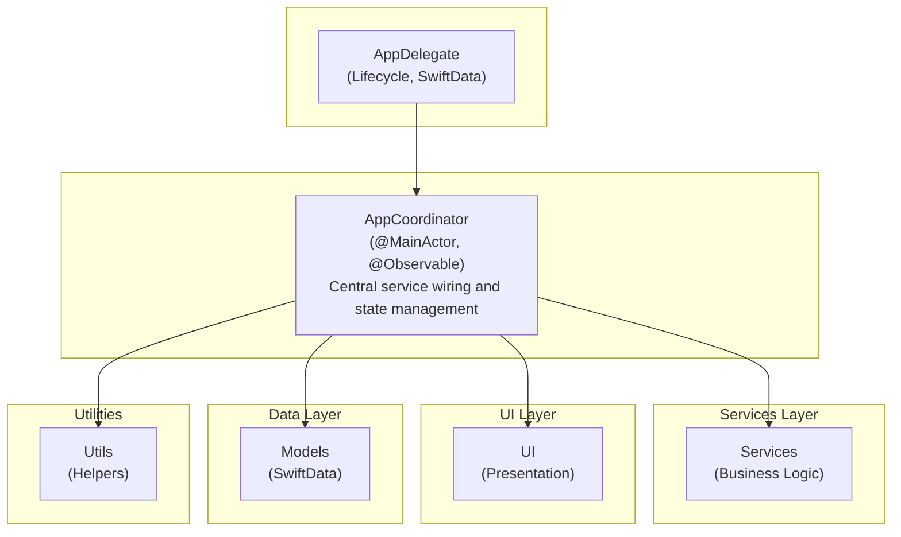
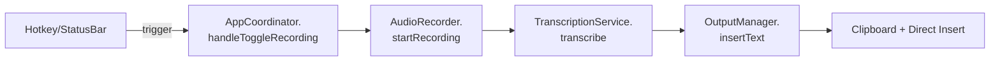

# Repository Guidelines

**Generated:** 2026-02-16
**Project:** Pindrop
**Language:** Swift 5.9+
**Platform:** macOS 14.0+

---

## 1. Project Overview

Pindrop is a 100% open-source, truly Mac-native AI dictation app that runs entirely in the macOS menu bar. It provides private, offline speech-to-text using OpenAI's Whisper model via WhisperKit (Apple Core ML optimized).

**Key characteristics:**
- Menu bar only app (LSUIElement=true, no dock icon by default)
- 100% local transcription - voice never leaves the Mac
- Pure Swift/SwiftUI - no web wrappers
- Apple Silicon optimized via Core ML
- Single external dependency: WhisperKit

---

## 2. Architecture & Data Flow

### High-Level Architecture



### Data Flow

**Recording Flow:**


**Settings Flow:**
```mermaid
flowchart TD
    A[SettingsStore<br/>@AppStorage + Keychain] -->|publishes changes| B[AppCoordinator]
    B -->|notifies| C[Individual Services]
    C -->|react| D[Update behavior]
```

### Service Architecture

All services follow the `@MainActor final class` pattern:

```swift
@MainActor
@Observable                    // If reactive state needed
final class MyService {
    private(set) var isActive = false

    func doWork() async throws {
        // Implementation
    }
}
```

**Exception:** `HotkeyManager` is not `@MainActor` because it uses Carbon Events which must run on the main thread but has specific threading requirements.

---

## 3. Key Directories

```
Pindrop/
├── PindropApp.swift           # @main entry, AppDelegate
├── AppCoordinator.swift       # Central coordinator, wires all services
│
├── Services/                  # 32 service modules
│   ├── AudioRecorder.swift    # AVAudioEngine, 16kHz mono PCM
│   ├── TranscriptionService.swift  # State machine, orchestrates engines
│   ├── ModelManager.swift     # WhisperKit model downloads
│   ├── HotkeyManager.swift    # Carbon Events global hotkeys
│   ├── SettingsStore.swift    # @AppStorage + Keychain persistence
│   ├── HistoryStore.swift     # SwiftData transcription history
│   ├── OutputManager.swift    # Clipboard + Accessibility insertion
│   ├── AIEnhancementService.swift  # Optional OpenAI-compatible API
│   ├── PermissionManager.swift     # Mic + Accessibility permissions
│   ├── Transcription/         # Transcription engine implementations
│   │   ├── WhisperKitEngine.swift
│   │   ├── ParakeetEngine.swift
│   │   └── StreamingTranscriptionEngine.swift
│   └── ... (see full listing below)
│
├── UI/                        # SwiftUI views
│   ├── Components/            # Reusable components (CopyButton, etc.)
│   ├── Main/                  # Dashboard, History, Notes views
│   ├── Settings/              # All settings panels
│   ├── Onboarding/            # First-run onboarding flow
│   ├── Theme/                 # AppTheme, colors, typography
│   ├── StatusBarController.swift   # NSStatusBar menu
│   ├── FloatingIndicator.swift     # Recording indicator overlay
│   └── PillFloatingIndicator.swift # VoiceInk-style pill indicator
│
├── Models/                    # SwiftData models
│   ├── TranscriptionRecord.swift   # History item entity
│   ├── WordReplacement.swift       # Dictionary replacements
│   ├── VocabularyWord.swift        # Custom vocabulary
│   ├── Note.swift                  # Note-taking feature
│   └── PromptPreset.swift          # AI enhancement presets
│
├── Utils/                     # Utilities
│   ├── Logger.swift           # Log enum with os.log categories
│   ├── AlertManager.swift     # Alert presentation helper
│   └── Icons.swift            # App icons/assets helper
│
└── Resources/                 # Built-in presets, assets

PindropTests/                  # XCTest suite
├── TestHelpers/               # MockAudioCaptureBackend, etc.
├── *Tests.swift               # 27 test files
└── ...

Pindrop.xcodeproj/             # Xcode project
└── xcshareddata/xctestplans/
    ├── Unit.xctestplan        # Default test plan
    └── Integration.xctestplan # Integration tests
```

---

## 4. Development Commands

All commands use `just` (command runner). Install: `brew install just`

### Build Commands

```bash
just build                    # Debug build
just build-release           # Release build
just build-self-signed       # Self-signed release (no dev account)
just typecheck               # Type check without building
just clean                   # Clean all build artifacts
```

### Test Commands

```bash
just test                     # Run unit tests (default plan)
just test-integration         # Run integration tests
just test-all                 # Run both unit + integration
just test-coverage           # Run tests with coverage

# Direct xcodebuild for specific tests
xcodebuild test -scheme Pindrop -testPlan Unit -destination 'platform=macOS'
xcodebuild test -scheme Pindrop -destination 'platform=macOS' -only-testing:PindropTests/AudioRecorderTests
```

### Release Commands

```bash
just dmg                      # Build release + create DMG
just dmg-self-signed          # Self-signed DMG
just release 1.5.5           # Bump version, tag, push → triggers CI
just appcast dist/Pindrop.dmg # Generate Sparkle appcast.xml
```

### Lint/Format (Optional)

```bash
just lint                     # SwiftLint (brew install swiftlint)
just format                   # SwiftFormat (brew install swiftformat)
```

### Development Workflow

```bash
just dev                     # Clean + build + test
just ci                      # Full CI workflow
just xcode                   # Open in Xcode
```

---

## 5. Code Conventions & Common Patterns

### File Headers

```swift
//
//  AudioRecorder.swift
//  Pindrop
//
//  Created on 2026-01-25.
//
```

### Import Order

```swift
import Foundation              // Always first
import SwiftUI                 // Apple frameworks
import AVFoundation
import AppKit
import SwiftData
import WhisperKit              // External packages (after built-in)
import os.log                  // Logging last
```

### Naming Conventions

| Type | Convention | Example |
|------|------------|---------|
| Types | PascalCase | `AudioRecorder`, `TranscriptionError` |
| Variables/Functions | camelCase | `isRecording`, `startRecording()` |
| Constants | camelCase (local), PascalCase (static) | `let timeout = 5`, `Defaults.timeout` |
| Test files | `*Tests.swift` | `AudioRecorderTests.swift` |
| Test variable | `sut` | System Under Test |

### Error Handling

Define nested error enum per service:

```swift
enum AudioRecorderError: Error, LocalizedError {
    case permissionDenied
    case engineStartFailed(String)

    var errorDescription: String? {
        switch self {
        case .permissionDenied:
            return "Microphone permission denied"
        case .engineStartFailed(let msg):
            return "Audio engine failed: \(msg)"
        }
    }
}
```

### Service Pattern

```swift
@MainActor
@Observable                    // Include if reactive state needed
final class MyService {
    private(set) var isActive = false

    func doWork() async throws {
        // Async for I/O operations
    }
}
```

### Dependency Injection

Services receive dependencies via initializer:

```swift
@MainActor
final class AudioRecorder {
    private let permissionManager: PermissionManager
    private let captureBackend: AudioCaptureBackend

    init(
        permissionManager: PermissionManager,
        captureBackend: AudioCaptureBackend
    ) {
        self.permissionManager = permissionManager
        self.captureBackend = captureBackend
    }
}
```

For testing, use protocol-based mocking:

```swift
protocol AudioCaptureBackend: AnyObject {
    var isCapturing: Bool { get }
    func startCapture(...) throws
    func stopCapture() throws -> [AVAudioPCMBuffer]
}

// Production
final class AVAudioEngineCaptureBackend: AudioCaptureBackend { ... }

// Test
final class MockAudioCaptureBackend: AudioCaptureBackend { ... }
```

### State Management

- **AppCoordinator**: Central @Observable state holder, wires all services
- **SettingsStore**: @AppStorage + Keychain, ObservableObject for SwiftUI
- **Individual Services**: @Observable for their own reactive state
- **HotkeyManager**: Not @MainActor, uses Combine for state publishing

### Logging

Use the `Log` enum with appropriate category:

```swift
Log.audio.info("Starting recording")
Log.transcription.error("Transcription failed: \(error)")
Log.model.debug("Loading model: \(modelName)")
```

**Available categories:** `audio`, `transcription`, `model`, `output`, `hotkey`, `app`, `ui`, `update`, `aiEnhancement`, `context`

### Async/Await Patterns

- All I/O operations use `async throws`
- Permission requests are async
- Recording start/stop are async
- Model downloads are async with progress

```swift
func startRecording() async throws {
    let granted = await permissionManager.requestMicrophonePermission()
    guard granted else { throw AudioRecorderError.permissionDenied }
    // ...
}
```

### SwiftData Usage

Models use SwiftData with explicit schemas:

```swift
@Model
final class TranscriptionRecord {
    @Attribute(.unique) var id: UUID
    var text: String
    var createdAt: Date
    // ...
}
```

Schema migrations are handled via `TranscriptionRecordSchema.swift`, `NoteSchema.swift`.

---

## 6. Important Files

| File | Purpose |
|------|---------|
| `Pindrop/PindropApp.swift` | @main entry point, AppDelegate with lifecycle |
| `Pindrop/AppCoordinator.swift` | Central service wiring, 2800+ lines of coordination |
| `Pindrop/Services/SettingsStore.swift` | All settings persistence (@AppStorage + Keychain) |
| `Pindrop/Services/HotkeyManager.swift` | Carbon Events global hotkey registration |
| `Pindrop/Services/TranscriptionService.swift` | Transcription orchestration state machine |
| `Pindrop/Services/AudioRecorder.swift` | AVAudioEngine audio capture |
| `Pindrop/Utils/Logger.swift` | Log enum with os.log categories |
| `Pindrop.xcodeproj/project.pbxproj` | Xcode project configuration |
| `Justfile` | Build commands and automation |
| `Info.plist` | App metadata, Sparkle update configuration |

---

## 7. Runtime/Tooling Preferences

### Required

- **macOS 14.0+** (Sonoma) - Uses SwiftData, @Observable
- **Xcode 15+** - Swift 5.9+ support
- **Apple Silicon** (M1/M2/M3/M4) - Core ML optimization, Intel not supported

### Recommended Tools

```bash
brew install just              # Command runner (required for just commands)
brew install swiftlint         # Linting (optional)
brew install swiftformat       # Formatting (optional)
brew install create-dmg        # DMG creation for releases
```

### Package Manager

- **Swift Package Manager** via Xcode - WhisperKit is the only external dependency
- No CocoaPods or Carthage

### Version Management

Uses `agvtool` (Apple Generic Versioning Tool):

```bash
agvtool what-version           # Show current build number
agvtool what-marketing-version # Show current marketing version
agvtool next-version -all      # Bump build number
```

---

## 8. Testing & QA

### Test Framework

- **XCTest** - Apple's standard testing framework
- **Test plans** - `Unit.xctestplan` (default) and `Integration.xctestplan`
- **@MainActor** - All test classes use `@MainActor` to match service isolation

### Test Isolation

Tests run with `PINDROP_TEST_MODE=1` environment variable:

- **SettingsStore** uses test-only UserDefaults suite
- **Keychain** uses test-only access group
- **Permissions** are mocked via `MockPermissionProvider`
- **Audio capture** is mocked via `MockAudioCaptureBackend`

### Test Structure

```swift
@MainActor
final class MyServiceTests: XCTestCase {
    var sut: MyService!           // System Under Test
    var mockDependency: MockDependency!

    override func setUpWithError() throws {
        try super.setUpWithError()
        mockDependency = MockDependency()
        sut = MyService(dependency: mockDependency)
    }

    override func tearDownWithError() throws {
        sut = nil
        mockDependency = nil
        try super.tearDownWithError()
    }

    func testFeature() async throws {
        // Given
        mockDependency.mockValue = expected

        // When
        let result = try await sut.doWork()

        // Then
        XCTAssertEqual(result, expected)
    }
}
```

### Test Files (27 total)

| Category | Files |
|----------|-------|
| Core Services | AudioRecorderTests, TranscriptionServiceTests, HotkeyManagerTests, SettingsStoreTests, HistoryStoreTests, ModelManagerTests |
| Transcription Engines | TranscriptionEngineTests, WhisperKitEngineTests, ParakeetEngineTests |
| AI/Context | AIEnhancementServiceTests, ContextEngineServiceTests, ContextCaptureServiceTests, MentionRewriteServiceTests |
| Features | DictionaryStoreTests, NotesStoreTests, PromptPresetStoreTests, UpdateServiceTests, OutputManagerTests |
| Mocks | MockAudioCaptureBackend, MockPermissionProvider |

### Running Tests

```bash
# All unit tests
just test

# Specific test plan
xcodebuild test -scheme Pindrop -testPlan Unit -destination 'platform=macOS'

# Single test class
xcodebuild test -scheme Pindrop -destination 'platform=macOS' -only-testing:PindropTests/AudioRecorderTests

# Single test method
xcodebuild test -scheme Pindrop -destination 'platform=macOS' -only-testing:PindropTests/AudioRecorderTests/testStartRecordingRequestsPermission
```

---

## 9. Conventions Reference

| Convention | Implementation |
|------------|----------------|
| @MainActor | All service classes except HotkeyManager |
| @Observable | AppCoordinator, TranscriptionService, individual services with reactive state |
| Settings | @AppStorage for preferences, Keychain for secrets |
| Data persistence | SwiftData only (no Core Data) |
| Permissions | Request on first use, never on launch |
| Errors | Nested enum per service, conform to LocalizedError |
| Logging | Use `Log.{category}` with os.log |

---

## 10. Anti-Patterns (Never Do)

| Don't | Reason | Do Instead |
|-------|--------|------------|
| Store API keys in UserDefaults | Security | `SettingsStore.saveAPIKey()` → Keychain |
| Auto-request permissions on launch | Bad UX | Request on first actual use |
| Use Core Data directly | Use SwiftData | SwiftData with ModelContainer |
| Force unwrap (`!`) or `as!` | Type safety | `guard let`, `if let`, optional chaining |
| Override system shortcuts | User confusion | Warn about conflicts, allow customization |
| Require Accessibility permission | Must have fallback | Clipboard always works without it |
| Edit history transcriptions | History is immutable | Create new transcription if needed |

---

## 11. Product Scope Boundaries

Features **intentionally not implemented** (out of scope):

- Batch file transcription (live dictation only)
- Multi-language support (English only in v1)
- Speaker diarization
- Sync/account system
- Telemetry without explicit consent
- Intel Mac support / pre-Sonoma macOS
- Per-application hotkey profiles

---

## 12. CI/CD

GitHub Actions workflows in `.github/workflows/`:

- **ci.yml** - Build and test on every push
- **release.yml** - Signed builds and DMG creation on version tags

Release process:

```bash
just release 1.5.5    # Bumps version, commits, tags, pushes
# → GitHub Actions builds, signs, creates release
```

Sparkle auto-updates:
- EdDSA (Ed25519) signing
- Public key in `Info.plist`
- Appcast generated via `just appcast`
