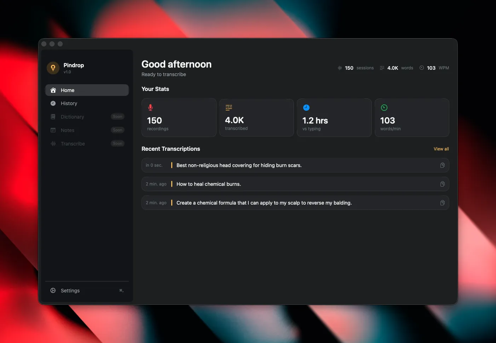

# Pindrop

A native macOS menu bar dictation app powered by local speech-to-text. Built with Swift, SwiftUI, and WhisperKit.



## What It Does

Pindrop turns your speech into text—right from your menu bar. No cloud servers, no subscriptions, no waiting. Just press a hotkey, speak, and watch your words appear wherever you need them.

### Key Features

- **100% Local Transcription** — Runs entirely on your Mac using OpenAI's Whisper model via WhisperKit. Your voice never leaves your computer.
- **Global Hotkeys** — Toggle mode (press to start, press to stop) or push-to-talk. Works from anywhere in macOS.
- **Smart Output** — Text is automatically copied to your clipboard and optionally inserted directly at your cursor.
- **Transcription History** — All your dictations are saved locally with full search. Export to JSON, CSV, or plain text.
- **Multiple Model Sizes** — Choose from Tiny (fastest) to Large (most accurate) depending on your needs.
- **AI Enhancement (Optional)** — Clean up transcriptions using any OpenAI-compatible API—completely optional and off by default.
- **Beautiful macOS Design** — Native SwiftUI interface that feels at home on your Mac.

## Requirements

- **macOS 14.0 (Sonoma) or later**
- **Apple Silicon (M1/M2/M3/M4)** recommended for optimal performance
- **Microphone access** (required for recording)
- **Accessibility permission** (optional, enables direct text insertion; clipboard works without it)

## Building from Source

Since this is an open-source project, you'll need to build it yourself. Don't worry—it's straightforward.

### Step 1: Clone the Repository

```bash
git clone https://github.com/watzon/pindrop.git
cd pindrop
```

### Step 2: Open in Xcode

```bash
open Pindrop.xcodeproj
```

Or simply double-click `Pindrop.xcodeproj` in Finder.

### Step 3: Build and Run

1. In Xcode, select a scheme from the toolbar (Pindrop should be selected by default)
2. Press `Cmd+R` or click the Run button
3. The app will compile and launch

After the first build, Pindrop will appear in your menu bar (look for the microphone icon). The app runs exclusively in the menu bar—no dock icon.

### Building for Release

To create a distributable build:

```bash
xcodebuild -scheme Pindrop -configuration Release build
```

The compiled app will be in `build/Release/Pindrop.app`.

## First Launch

When you first open Pindrop, you'll see an onboarding flow:

1. **Grant Microphone Permission** — Required for recording dictations
2. **Download a Model** — Start with "Tiny" for the fastest experience (about 75MB)
3. **Set Up Your Hotkey** — Default is Option+Space for toggle mode
4. **You're Ready** — Press your hotkey and start dictating

## Usage

### Recording Modes

**Toggle Mode** (default: `Option+Space`)
- Press once to start recording (menu bar icon turns red)
- Press again to stop and transcribe
- Your transcribed text appears in your clipboard immediately

**Push-to-Talk**
- Hold your hotkey to record
- Release to stop and transcribe
- Configure a different hotkey in Settings → Hotkeys

### Output

Transcribed text is always copied to your clipboard. If you've granted Accessibility permission, it's also inserted directly at your cursor in the active application.

### History

Access all your past transcriptions:
- Click the menu bar icon → History (or press `Cmd+H`)
- Search through any transcription
- Copy individual entries or export to JSON/CSV/plain text

## Settings

### General
- **Output Mode**: Clipboard only, or clipboard + direct insertion
- **Language**: English (more languages coming in future updates)

### Hotkeys
- Configure your toggle hotkey and push-to-talk hotkey
- Press the "Record New Hotkey" button and press your desired keys

### Models
| Model | Size | Speed | Accuracy |
|-------|------|-------|----------|
| Tiny | ~75 MB | Fastest | Good |
| Base | ~150 MB | Fast | Good |
| Small | ~500 MB | Medium | Better |
| Medium | ~1.5 GB | Slower | High |
| Large | ~3 GB | Slowest | Highest |

Start with Tiny or Base for daily use. Switch to Medium or Large when you need maximum accuracy.

### AI Enhancement
- Toggle AI-powered text cleanup on/off
- Enter any OpenAI-compatible API endpoint
- Your API key is stored securely in the macOS Keychain—not in UserDefaults

## Troubleshooting

### App doesn't appear in menu bar
Pindrop is a menu bar-only app—it intentionally has no dock icon. Look for the microphone icon in the top-right corner of your menu bar.

### Microphone permission denied
1. Open **System Settings → Privacy & Security → Microphone**
2. Enable permission for Pindrop
3. Restart the app

### Direct text insertion not working
1. Open **System Settings → Privacy & Security → Accessibility**
2. Click "+" and add Pindrop
3. Restart the app
4. Clipboard output still works without this permission

### Transcription is slow
- Use a smaller model (Tiny or Base)
- Make sure you're on Apple Silicon (Intel Macs are supported but slower)
- Close other resource-intensive applications

### Model download fails
- Check your internet connection
- Ensure you have enough disk space (75MB–3GB depending on model)
- Try downloading again from Settings → Models

### Hotkey doesn't work
- Check for conflicts with other apps
- Try a different key combination
- Click the menu bar icon first to ensure the app has focus

## Architecture

```
Pindrop/
├── Pindrop/                     # Main app bundle
│   ├── PindropApp.swift         # App entry point + lifecycle
│   ├── AppCoordinator.swift     # Central service coordination
│   ├── Services/
│   │   ├── AudioRecorder.swift      # AVAudioEngine recording
│   │   ├── TranscriptionService.swift # WhisperKit integration
│   │   ├── ModelManager.swift       # Model downloads
│   │   ├── HotkeyManager.swift      # Global shortcuts
│   │   ├── OutputManager.swift      # Clipboard + text insertion
│   │   ├── HistoryStore.swift       # SwiftData persistence
│   │   ├── SettingsStore.swift      # Settings + Keychain
│   │   ├── PermissionManager.swift  # Permissions handling
│   │   └── AIEnhancementService.swift # Optional AI cleanup
│   ├── Models/
│   │   └── TranscriptionRecord.swift
│   ├── UI/
│   │   ├── StatusBarController.swift   # Menu bar icon
│   │   ├── SettingsWindow.swift        # Settings UI
│   │   ├── HistoryWindow.swift         # History UI
│   │   └── FloatingIndicator.swift     # Recording indicator
│   └── Utils/
│       ├── Logger.swift           # Logging wrapper
│       └── AlertManager.swift     # Alert handling
├── PindropTests/                  # XCTest suite
└── Pindrop.xcodeproj              # Xcode project
```

## Running Tests

```bash
xcodebuild test -scheme Pindrop -destination 'platform=macOS'
```

## License

MIT License. See the [LICENSE](LICENSE) file for details.

## Acknowledgments

- [WhisperKit](https://github.com/argmaxinc/WhisperKit) — The Swift implementation that makes this possible
- [OpenAI Whisper](https://github.com/openai/whisper) — The original speech recognition model

## Contributing

Contributions are welcome! Feel free to open issues or submit pull requests.

---

**Note**: This project is currently open source and free to build yourself. Pre-built binaries may be available for purchase in the future.
