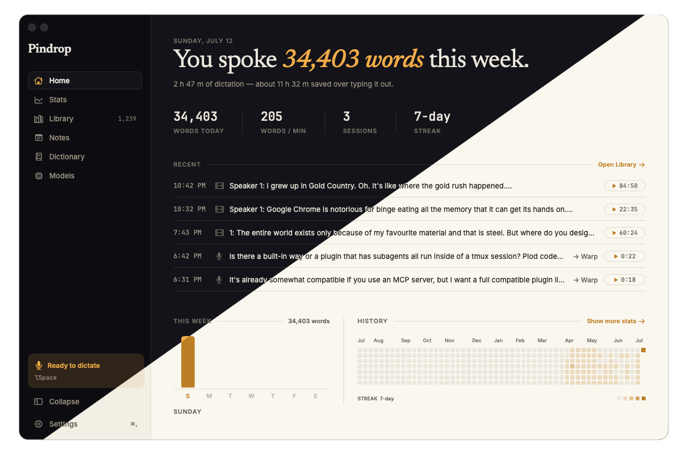

# Pindrop 🎤

> The only 100% open source, truly Mac-native AI dictation app

[](https://github.com/watzon/pindrop/stargazers)
[](LICENSE)
[](https://www.apple.com/macos/)
[](https://swift.org/)



**Pindrop** is a menu bar dictation app for macOS that turns your speech into text—completely offline, completely private. Built with pure Swift/SwiftUI and powered by WhisperKit for optimal Apple Silicon performance.

**[Download Latest Release](https://github.com/watzon/pindrop/releases)** · **[Documentation](#documentation)** · **[Contributing](#contributing)** · **[Community](#community)**

---

## Why Pindrop?

While other dictation apps compromise on privacy, performance, or platform fidelity, Pindrop is designed specifically for Mac users who refuse to compromise.

| Pillar                         | What It Means                                                              |
| ------------------------------ | -------------------------------------------------------------------------- |
| 🍎 **Mac-Native**              | Pure Swift/SwiftUI—not a web wrapper. Feels like Apple built it.           |
| 🔒 **Privacy-First**           | 100% local transcription. Your voice never leaves your Mac.                |
| ⚡ **Apple Silicon Optimized** | WhisperKit + Core ML = 2-3x faster than generic Whisper on M-series chips. |
| 🏆 **100% Open Source**        | No freemium tiers, no "Pro" features, no lock-in. Ever.                    |

---

## Comparison

| Feature             | Pindrop                    | Handy                 | OpenWhispr                     |
| ------------------- | -------------------------- | --------------------- | ------------------------------ |
| **Platform**        | macOS only                 | Windows, macOS, Linux | Windows, macOS, Linux          |
| **Framework**       | Swift/SwiftUI (native)     | Tauri (Rust + Web)    | Tauri (Rust + Web)             |
| **ML Engine**       | WhisperKit (Apple Core ML) | Generic Whisper       | Generic Whisper                |
| **Apple Silicon**   | Native optimization        | Emulated              | Emulated                       |
| **Source Code**     | 100% open source           | 100% open source      | Freemium (paid "Lazy Edition") |
| **Battery Impact**  | Minimal (native)           | Higher (web runtime)  | Higher (web runtime)           |
| **Menu Bar Design** | First-class native         | Web-based UI          | Web-based UI                   |

**The bottom line:** If you want the best dictation experience on a Mac—maximum speed, minimal battery drain, and true native feel—Pindrop is the only choice.

---

## Features

- **100% Local Transcription** — Runs entirely on your Mac using OpenAI's Whisper model via WhisperKit. Your voice never leaves your computer.
- **Multiple Transcription Engines** — Choose between WhisperKit (Core ML optimized) and Parakeet, with streaming transcription support for real-time results.
- **Global Hotkeys** — Toggle mode (press to start, press to stop) or push-to-talk. Works from anywhere in macOS.
- **Smart Output** — Text is automatically copied to your clipboard and optionally inserted directly at your cursor.
- **Notes System** — Full note-taking with pinning, tagging, and AI-powered title generation. Organize and revisit your transcriptions as structured notes.
- **Transcription History** — All your dictations are saved locally with full search. Export to JSON, CSV, or plain text.
- **Multiple Model Sizes** — Choose from Tiny (fastest) to Large (most accurate) depending on your needs.
- **AI Enhancement (Optional)** — Clean up transcriptions using any OpenAI-compatible API—completely optional and off by default.
- **Custom Dictionary** — Define custom word replacements and vocabulary to improve transcription accuracy for names, jargon, and specialized terms.
- **Media Controls** — Automatic media pausing and system audio muting during recording so your transcription stays clean.
- **Auto-Updates** — Sparkle-based automatic update system keeps Pindrop up to date with zero effort.
- **Beautiful macOS Design** — Native SwiftUI interface that feels at home on your Mac.

---

## Built With

- **[Swift](https://swift.org/)** — Apple's modern, fast, and safe programming language
- **[SwiftUI](https://developer.apple.com/swiftui/)** — Declarative UI framework for truly native Mac apps
- **[WhisperKit](https://www.argmaxinc.com/whisperkit)** — High-performance Core ML implementation of OpenAI Whisper by Argmax, Inc.
- **[SwiftData](https://developer.apple.com/documentation/swiftdata)** — Modern data persistence framework
- **Just one external dependency** — WhisperKit. Everything else is Apple's first-party frameworks.

## Requirements

- **macOS 14.0 (Sonoma) or later**
- **Apple Silicon (M1/M2/M3/M4)** recommended for optimal performance
- **Microphone access** (required for recording)
- **Accessibility permission** (optional, enables direct text insertion; clipboard works without it)

## Installation

Pindrop releases are now signed with the project's Apple Developer identity. After the app is notarized and stapled, macOS should open it normally:

1. Download `Pindrop.dmg` from the [releases page](https://github.com/watzon/pindrop/releases)
2. Open the DMG and drag Pindrop to Applications
3. Launch Pindrop from Applications
4. If you downloaded a build that has not been notarized yet, macOS may still warn on first launch:
   - Right-click Pindrop → Open, or
   - Open System Settings → Privacy & Security and use "Open Anyway"
5. After notarization, Pindrop should launch without the old self-signed workaround

**For maintainers:** the default local release flow now exports a signed app bundle before packaging the DMG. `just dmg-self-signed` remains available only as a fallback when Apple signing is unavailable.

## Screenshots

*Coming soon: Notes & History dashboard, AI Enhancement settings, Recording indicator*

## Building from Source

Since this is an open-source project, you can also build it yourself. Don't worry—it's straightforward.

### Step 1: Clone the Repository

```bash
git clone https://github.com/watzon/pindrop.git
cd pindrop
```

### Step 2: Open in Xcode

```bash
open Pindrop.xcodeproj
```

Or simply double-click `Pindrop.xcodeproj` in Finder.

### Step 3: Build and Run

1. In Xcode, select a scheme from the toolbar (Pindrop should be selected by default)
2. Press `Cmd+R` or click the Run button
3. The app will compile and launch

After the first build, Pindrop will appear in your menu bar (look for the microphone icon). The app runs exclusively in the menu bar—no dock icon.

### Using the Build System (Recommended)

This project includes a `justfile` for common build tasks. Install `just` if you haven't already:

```bash
brew install just
```

**Common commands:**

```bash
just build              # Build for development (Debug)
just build-release      # Build for release
just export-app         # Export a signed app for distribution
just dmg                # Export signed app + create DMG
just test               # Run tests
just dmg-self-signed    # Fallback self-signed DMG
just clean              # Clean build artifacts
just --list             # Show all available commands
```

**Release commands (maintainers):**

```bash
just release-notes 1.9.0  # Create draft release notes file at release-notes/v1.9.0.md
just release 1.9.0  # Local manual release (tests, signed DMG, notarize/staple, appcast, tag, push tag, GitHub release)
```

### Manual Build (Alternative)

To create a distributable build manually:

```bash
xcodebuild -scheme Pindrop -configuration Release build
```

The compiled app will be in `DerivedData/Build/Products/Release/Pindrop.app`.

### Exporting a Signed App

To export a Developer ID-signed app bundle:

```bash
just export-app
```

### Creating a DMG

To create a distributable signed DMG:

```bash
just dmg
```

This requires `create-dmg`:

```bash
brew install create-dmg
```

The DMG will be created in `dist/Pindrop.dmg`.

### Creating a Release

Releases are published manually from a local machine using `just` + `gh`.
Use either the one-command flow or the explicit step-by-step flow.

```bash
# One command (recommended)
just release 1.9.0
```

Equivalent explicit steps:

```bash
# 0. Create and edit contextual release notes
just release-notes 1.9.0

# 1. Ensure tests pass
just test

# 2. Build signed release DMG
just dmg

# 3. Generate appcast.xml for the current version
just appcast dist/Pindrop.dmg

# 4. Create and push tag
git tag -a v1.9.0 -m "Release v1.9.0"
git push origin v1.9.0

# 5. Create GitHub release with notes + attach DMG + appcast.xml
gh release create v1.9.0 dist/Pindrop.dmg appcast.xml --title "Pindrop v1.9.0" --notes-file release-notes/v1.9.0.md
```

## First Launch

When you first open Pindrop, you'll see an onboarding flow:

1. **Grant Microphone Permission** — Required for recording dictations
2. **Download a Model** — Start with "Tiny" for the fastest experience (about 75MB)
3. **Set Up Your Hotkey** — Default is Option+Space for toggle mode
4. **You're Ready** — Press your hotkey and start dictating

## Usage

### Recording Modes

**Toggle Mode** (default: `Option+Space`)

- Press once to start recording (menu bar icon turns red)
- Press again to stop and transcribe
- Your transcribed text appears in your clipboard immediately

**Push-to-Talk**

- Hold your hotkey to record
- Release to stop and transcribe
- Configure a different hotkey in Settings → Hotkeys

### Output

Transcribed text is always copied to your clipboard. If you've granted Accessibility permission, it's also inserted directly at your cursor in the active application.

### History

Access all your past transcriptions:

- Click the menu bar icon → History (or press `Cmd+H`)
- Search through any transcription
- Copy individual entries or export to JSON/CSV/plain text

## Settings

### General

- **Output Mode**: Clipboard only, or clipboard + direct insertion
- **Language**: English (more languages coming in future updates)

### Hotkeys

- Configure your toggle hotkey and push-to-talk hotkey
- Press the "Record New Hotkey" button and press your desired keys

### Models

| Model  | Size    | Speed   | Accuracy |
| ------ | ------- | ------- | -------- |
| Tiny   | ~75 MB  | Fastest | Good     |
| Base   | ~150 MB | Fast    | Good     |
| Small  | ~500 MB | Medium  | Better   |
| Medium | ~1.5 GB | Slower  | High     |
| Large  | ~3 GB   | Slowest | Highest  |

Start with Tiny or Base for daily use. Switch to Medium or Large when you need maximum accuracy.

### AI Enhancement

- Toggle AI-powered text cleanup on/off
- Enter any OpenAI-compatible API endpoint
- Your API key is stored securely in the macOS Keychain—not in UserDefaults

## Troubleshooting

### App doesn't appear in menu bar

Pindrop is a menu bar-only app—it intentionally has no dock icon. Look for the microphone icon in the top-right corner of your menu bar.

### Microphone permission denied

1. Open **System Settings → Privacy & Security → Microphone**
2. Enable permission for Pindrop
3. Restart the app

### Direct text insertion not working

1. Open **System Settings → Privacy & Security → Accessibility**
2. Click "+" and add Pindrop
3. Restart the app
4. Clipboard output still works without this permission

### Transcription is slow

- Use a smaller model (Tiny or Base)
- Make sure you're on Apple Silicon (Intel Macs are supported but slower)
- Close other resource-intensive applications

### Model download fails

- Check your internet connection
- Ensure you have enough disk space (75MB–3GB depending on model)
- Try downloading again from Settings → Models

### Hotkey doesn't work

- Check for conflicts with other apps
- Try a different key combination
- Click the menu bar icon first to ensure the app has focus

## Architecture

```
Pindrop/
├── Pindrop/                     # Main app bundle
│   ├── PindropApp.swift         # App entry point + lifecycle
│   ├── AppCoordinator.swift     # Central service coordination
│   ├── Services/
│   │   ├── AudioRecorder.swift          # AVAudioEngine recording
│   │   ├── AudioDeviceManager.swift     # Audio device selection
│   │   ├── TranscriptionService.swift   # Transcription orchestration
│   │   ├── Transcription/               # Transcription engine architecture
│   │   │   ├── TranscriptionEngine.swift        # Engine protocol
│   │   │   ├── StreamingTranscriptionEngine.swift # Streaming protocol
│   │   │   ├── WhisperKitEngine.swift           # WhisperKit backend
│   │   │   ├── ParakeetEngine.swift             # Parakeet backend
│   │   │   ├── AudioEngineCapabilities.swift    # Engine capability detection
│   │   │   ├── VoiceActivityDetector.swift      # VAD support
│   │   │   ├── SpeakerDiarizer.swift            # Speaker identification
│   │   │   └── TextToSpeechEngine.swift         # TTS support
│   │   ├── ModelManager.swift           # Model downloads
│   │   ├── HotkeyManager.swift          # Global shortcuts
│   │   ├── OutputManager.swift          # Clipboard + text insertion
│   │   ├── HistoryStore.swift           # SwiftData persistence
│   │   ├── NotesStore.swift             # Note-taking system
│   │   ├── SettingsStore.swift          # Settings + Keychain
│   │   ├── PermissionManager.swift      # Permissions handling
│   │   ├── AIEnhancementService.swift   # Optional AI cleanup
│   │   ├── AIModelService.swift         # AI model management
│   │   ├── MediaPauseService.swift      # Media pause during recording
│   │   ├── UpdateService.swift          # Sparkle auto-updates
│   │   ├── LaunchAtLoginManager.swift   # Login item management
│   │   ├── PromptPresetStore.swift      # AI prompt presets
│   │   ├── DictionaryStore.swift        # Custom dictionary
│   │   ├── ContextEngineService.swift   # Context engine
│   │   ├── ContextCaptureService.swift  # Context capture
│   │   ├── ContextEngineContracts.swift # Context engine protocols
│   │   ├── AppContextAdapter.swift      # App context bridging
│   │   ├── MentionFormatter.swift       # @mention formatting
│   │   ├── MentionRewriteService.swift  # Mention rewriting
│   │   ├── PathMentionResolver.swift    # Path mention resolution
│   │   └── WorkspaceFileIndexService.swift # Workspace file indexing
│   ├── Models/
│   │   ├── TranscriptionRecord.swift
│   │   ├── TranscriptionRecordSchema.swift
│   │   ├── Note.swift
│   │   ├── NoteSchema.swift
│   │   ├── PromptPreset.swift
│   │   ├── WordReplacement.swift
│   │   ├── VocabularyWord.swift
│   │   ├── FeatureModelType.swift
│   │   └── FloatingIndicatorType.swift
│   ├── UI/
│   │   ├── Main/
│   │   │   ├── MainWindow.swift
│   │   │   ├── DashboardView.swift
│   │   │   ├── HistoryView.swift
│   │   │   ├── DictionaryView.swift
│   │   │   └── NotesView.swift
│   │   ├── Settings/
│   │   │   ├── SettingsWindow.swift
│   │   │   ├── GeneralSettingsView.swift
│   │   │   ├── HotkeysSettingsView.swift
│   │   │   ├── ModelsSettingsView.swift
│   │   │   ├── AIEnhancementSettingsView.swift
│   │   │   ├── UpdateSettingsView.swift
│   │   │   ├── PresetManagementSheet.swift
│   │   │   └── AboutSettingsView.swift
│   │   ├── Onboarding/
│   │   │   ├── OnboardingWindow.swift
│   │   │   ├── OnboardingWindowController.swift
│   │   │   ├── WelcomeStepView.swift
│   │   │   ├── PermissionsStepView.swift
│   │   │   ├── ModelSelectionStepView.swift
│   │   │   ├── ModelDownloadStepView.swift
│   │   │   ├── HotkeySetupStepView.swift
│   │   │   ├── AIEnhancementStepView.swift
│   │   │   └── ReadyStepView.swift
│   │   ├── Theme/
│   │   │   └── Theme.swift
│   │   ├── Components/
│   │   │   ├── CopyButton.swift
│   │   │   ├── SearchableDropdown.swift
│   │   │   ├── MarkdownEditor.swift
│   │   │   └── NoteCardView.swift
│   │   ├── StatusBarController.swift   # Menu bar icon
│   │   ├── FloatingIndicator.swift     # Recording indicator
│   │   └── SplashScreen.swift
│   └── Utils/
│       ├── Logger.swift           # Logging wrapper
│       ├── AlertManager.swift     # Alert handling
│       ├── ModelCapabilities.swift # Model feature detection
│       ├── ImageResizer.swift     # Image utilities
│       └── Icons.swift            # Icon assets
├── PindropTests/                  # XCTest suite
└── Pindrop.xcodeproj              # Xcode project
```

## Running Tests

```bash
xcodebuild test -scheme Pindrop -destination 'platform=macOS'
```

## Community

Join the conversation and get help:

- **[GitHub Discussions](https://github.com/watzon/pindrop/discussions)** — Ask questions, share ideas, and connect with other users
- **[GitHub Issues](https://github.com/watzon/pindrop/issues)** — Report bugs or request features

## Contributing

We welcome contributions! Please see [CONTRIBUTING.md](CONTRIBUTING.md) for guidelines on how to get started.

Whether you're fixing a bug, adding a feature, or improving documentation, your help makes Pindrop better for everyone.

## License

MIT License. See the [LICENSE](LICENSE) file for details.

## Acknowledgments

- [WhisperKit](https://github.com/argmaxinc/WhisperKit) — The Swift implementation that makes this possible
- [OpenAI Whisper](https://github.com/openai/whisper) — The original speech recognition model

---

**Note**: This project is currently open source and free to build yourself. Pre-built binaries may be available for purchase in the future.

## Star History

[](https://www.star-history.com/#watzon/pindrop&type=date&legend=top-left)
